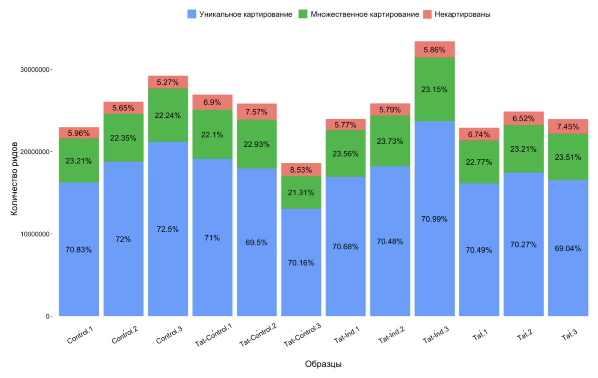
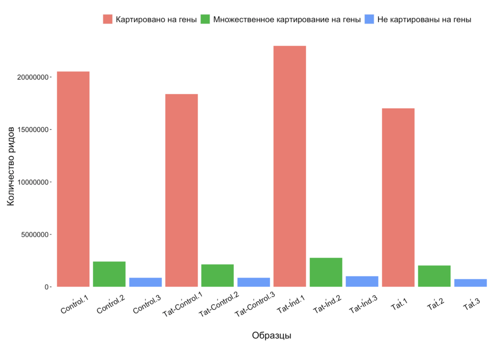
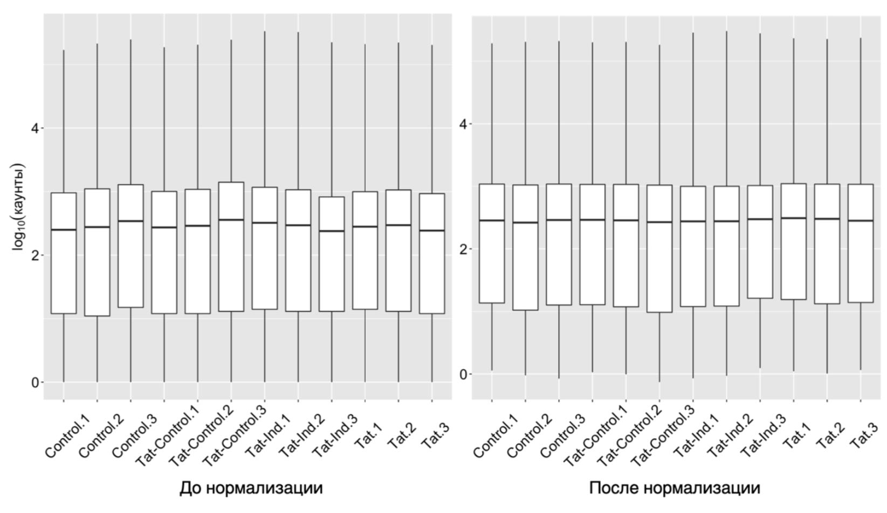
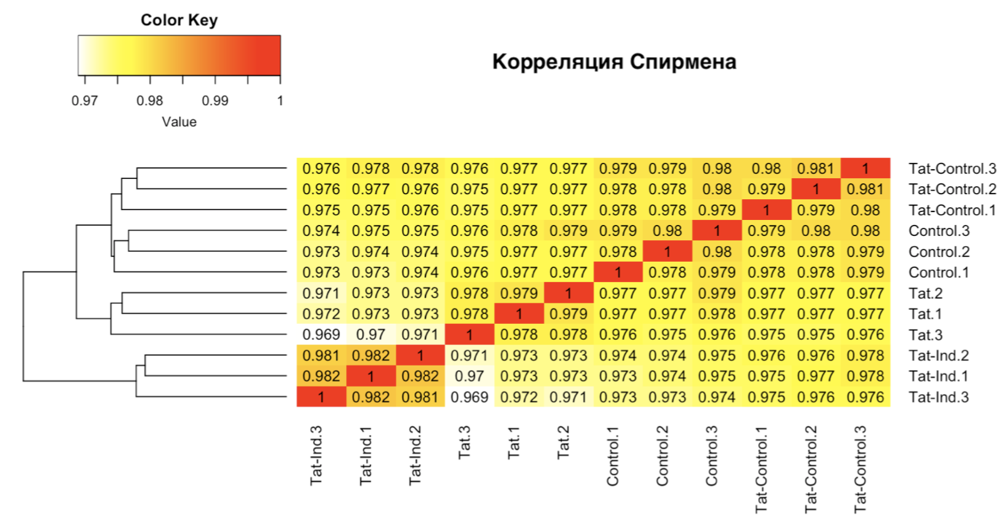
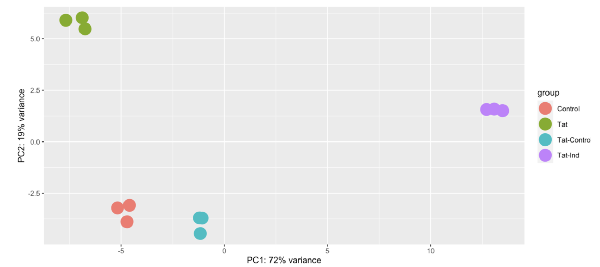

### Статистика по сырым ридам
```
library(ggplot2)
library(reshape2)
library(pheatmap)
library(genefilter)
library(plyr)


options(scipen=35000000) # Для нормального отображения больших чисел
data_for_hist_1 <- data.frame(Samples = c('Control.1','Control.1','Control.1',
                                          'Control.2','Control.2','Control.2',
                                          'Control.3','Control.3','Control.3',
                                          'Tat-Control.1','Tat-Control.1','Tat-Control.1',
                                          'Tat-Control.2','Tat-Control.2','Tat-Control.2',
                                          'Tat-Control.3','Tat-Control.3','Tat-Control.3',
                                          'Tat-Ind.1', 'Tat-Ind.1', 'Tat-Ind.1',
                                          'Tat-Ind.2', 'Tat-Ind.2', 'Tat-Ind.2', 
                                          'Tat-Ind.3', 'Tat-Ind.3', 'Tat-Ind.3',
                                          'Tat.1', 'Tat.1','Tat.1',
                                          'Tat.2', 'Tat.2','Tat.2',
                                          'Tat.3', 'Tat.3','Tat.3'),
                              Condition = c('Уникальное картирование', 'Некартированы', 'Множественное картирование',
                                            'Уникальное картирование', 'Некартированы', 'Множественное картирование',
                                            'Уникальное картирование', 'Некартированы', 'Множественное картирование',
                                            'Уникальное картирование', 'Некартированы', 'Множественное картирование',
                                            'Уникальное картирование', 'Некартированы', 'Множественное картирование',
                                            'Уникальное картирование', 'Некартированы', 'Множественное картирование',
                                            'Уникальное картирование', 'Некартированы', 'Множественное картирование',
                                            'Уникальное картирование', 'Некартированы', 'Множественное картирование',
                                            'Уникальное картирование', 'Некартированы', 'Множественное картирование',
                                            'Уникальное картирование', 'Некартированы', 'Множественное картирование',
                                            'Уникальное картирование', 'Некартированы', 'Множественное картирование',
                                            'Уникальное картирование', 'Некартированы', 'Множественное картирование'),
                              Percentage = c(70.83, 5.96, 23.21,
                                             72.00, 5.65, 22.35, 
                                             72.50,  5.27,22.24,
                                             71.00, 6.90, 22.10,
                                             69.50, 7.57, 22.93,
                                             70.16, 8.53, 21.31,
                                             70.68, 5.77, 23.56, 
                                             70.48, 5.79, 23.73, 
                                             70.99, 5.86, 23.15,
                                             70.49, 6.74, 22.77, 
                                             70.27, 6.52,  23.21, 
                                             69.04, 7.45, 23.51 ),
                              Results = c(16258448, 1369080, 5328104, 
                                          18782136, 1473827, 5830684, 
                                          21188345, 1539326, 6499145,
                                          19131748, 1858893, 5954837, 
                                          17962935, 1957533, 5927035, 
                                          13066260, 1588494, 3968305,
                                          16958755, 1383326, 5652830, 
                                          18236007, 1497897, 6139465,
                                          23716296, 1956962, 7732355,
                                          16146750, 1544960, 5214712, 
                                          17476915, 1620344, 5772063, 
                                          16539906, 1785936, 5631177))
data_for_hist_1 <- ddply(data_for_hist_1, .(Samples),
                         transform, pos = cumsum(Results) - (0.5 * Results))

ggplot(data_for_hist_1, aes(fill = Condition, x = Samples, y = Results)) +
  geom_bar(position="stack", stat="identity") +
  theme(panel.background=element_blank())+
  labs(x =  "Образцы", y = "Количество ридов")+
  geom_text(data = data_for_hist_1, aes(x = Samples, y = pos, label = paste0(Percentage,"%")), size = 5, stat="identity")+
  theme(axis.text.x = element_text(size = 13, colour="black", angle = 30))+
  theme(axis.text.y = element_text(size = 12, colour="black"))+
  theme(axis.title.x = element_text(size = 16, colour="black"))+
  theme(axis.title.y = element_text(size = 16, colour="black"))+
  theme(legend.position = "top",
        legend.text = element_text(colour = "black", size = 14),
        legend.title = element_text(colour = "white"),
  )                                   
```

```
data_for_hist_3 <- data.frame(Samples = c('Control.1','Control.2','Control.3',
                                          'Control.1','Control.2','Control.3',
                                          'Control.1','Control.2','Control.3',
                                          'Tat-Control.1','Tat-Control.2','Tat-Control.3',
                                          'Tat-Control.1','Tat-Control.2','Tat-Control.3',
                                          'Tat-Control.1','Tat-Control.2','Tat-Control.3',
                                          'Tat-Ind.1', 'Tat-Ind.2', 'Tat-Ind.3',
                                          'Tat-Ind.1', 'Tat-Ind.2', 'Tat-Ind.3',
                                          'Tat-Ind.1', 'Tat-Ind.2', 'Tat-Ind.3',
                                          'Tat.1', 'Tat.2','Tat.3',
                                          'Tat.1', 'Tat.2','Tat.3',
                                          'Tat.1', 'Tat.2','Tat.3'),
                              Condition = c('Картировано на гены', 'Не картированы на гены', 'Множественное картирование на гены',
                                            'Картировано на гены', 'Не картированы на гены', 'Множественное картирование на гены',
                                            'Картировано на гены', 'Не картированы на гены', 'Множественное картирование на гены',
                                            'Картировано на гены', 'Не картированы на гены', 'Множественное картирование на гены',
                                            'Картировано на гены', 'Не картированы на гены', 'Множественное картирование на гены',
                                            'Картировано на гены', 'Не картированы на гены', 'Множественное картирование на гены',
                                            'Картировано на гены', 'Не картированы на гены', 'Множественное картирование на гены',
                                            'Картировано на гены', 'Не картированы на гены', 'Множественное картирование на гены',
                                            'Картировано на гены', 'Не картированы на гены', 'Множественное картирование на гены',
                                            'Картировано на гены', 'Не картированы на гены', 'Множественное картирование на гены',
                                            'Картировано на гены', 'Не картированы на гены', 'Множественное картирование на гены',
                                            'Картировано на гены', 'Не картированы на гены', 'Множественное картирование на гены'),
                              Results = c(15734637, 671233, 1980243,
                                          18185313, 779565, 2168457,
                                          20530281, 857382, 2422789,
                                          18381099, 875235, 2135648,
                                          17303296, 821606, 2067638,
                                          12536577, 599383, 1453172,
                                          16412897, 736481, 1996116,
                                          17627962, 789589, 2131673,
                                          22967694, 1015559, 2771917,
                                          15701048, 671794, 1839697,
                                          17007957, 747567, 1998033,
                                          16115490, 699717, 2044391))
data_for_hist_3 <- ddply(data_for_hist_3, .(Samples),
                         transform, pos = cumsum(Results) - (0.5 * Results))

ggplot(data_for_hist_3, aes(fill = Condition, x = Samples, y = Results)) +
  geom_bar(position="dodge", stat="identity") +
  theme(panel.background=element_blank())+
  labs(x =  "Образцы", y = "Количество ридов", size = 20)+
  theme(axis.text.x = element_text(size = 13, colour="black", angle = 30))+
  theme(axis.text.y = element_text(size = 12, colour="black"))+
  theme(axis.title.x = element_text(size = 16, colour="black"))+
  theme(axis.title.y.left = element_text(size = 16, colour="black"))+
  theme(legend.position = "top",
        legend.text = element_text(colour = "black", size = 14),
        legend.title = element_text(colour = "white"),
  )
```

```
```
### Обработка данных Deseq
#### Коэффициенты нормализации
```
normalized_counts <- counts(dds, normalized=TRUE) # dds - результат Deseq2
write.table(counts(dds, normalized=TRUE), 'normalized_counts.tab', quote=F, col.names=T, row.names=T, sep='\t')

#box plot до и после нормализации

pseudoCount <- log10(counts(new_dds))
pseudoCount <- as.data.frame(pseudoCount)
df <-  melt(pseudoCount, variable.name = "Samples", value.name = "count") 
ggplot(df, aes(x = df$Samples, y = count)) + geom_boxplot() + xlab("") + ylab(expression(log[10](каунты)))

```

#### Корреляция Спирмана
```
norm_corr <- round(cor(counts(new_dds, normalized=TRUE),method = "spearman" ),3)
write.table(norm_corr, file="total_norm_corr.txt", col.names=T, row.names=T, sep='\t')
heatmap.2(norm_corr, col=rev(heat.colors(1000)), col.regions=heat.colors, cellnote = norm_corr, notecol="black", trace="none", density.info="none", dendrogram = "row", cexCol=1, cexRow =1, margins = c(9,9))
dev.off()
```

#### PCA
```
print( plotPCA( rld, intgroup = c( "sample", "condition")) + theme(panel.background=element_blank()))
pca <- plotPCA( rld)
pca + geom_point(size = 7)
pca <- plotPCA( rld) + geom_point(size = 7)
pca <- plot(pca, pch = 20)
```

