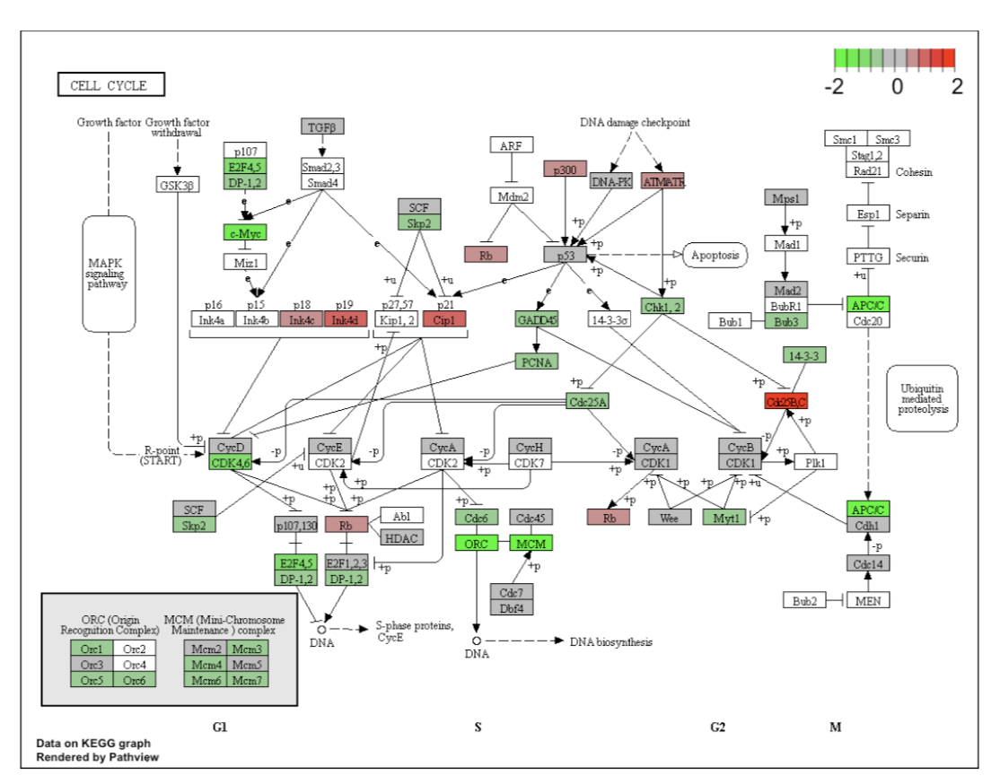

### Подготовка данных
```

library("pathview")

df_eKegg_s_c_up <- as.data.frame(eKegg_s_c_up)
df_eKegg_T16_T0_up <- as.data.frame(eKegg_T16_T0_up)
df_eKegg_T16_T0_down <- as.data.frame(eKegg_T16_T0_down)

path_16_0 <- cbind(res_T16_T0_padj$log2FoldChange)
rownames(path_16_0) <- res_T16_T0_padj$entrez

path_s_c <- cbind(res_s_c_padj$log2FoldChange)
rownames(path_s_c) <- res_s_c_padj$entrez
```
### Смотрим метаболизм по нужным категориям
#### Индуцибельная экспрессия
```
pathview(gene.data  = path_16_0,
        pathway.id = 'hsa03008', #hsa04110
        species    = "hsa",
        limit = list(gene = c(-2, 2), cpd = 1)) #Границы по log2FoldChange
```

```
# Метаболический путь "биогенез рибосом hsa03008"
```

```
# Метаболический путь "Клеточный цикл hsa04110"
```
#### Стабильная экспрессия
```
pathview(gene.data  = path_s_c,
         pathway.id = "hsa№№№№№",
         species    = "hsa",
         limit      = list(gene = c(-2, 2), cpd=1))


#### Чтобы посмотреть в браузере

browseKEGG(eKegg_s_c_up, 'hsa№№№№')
browseKEGG(eKegg_T16_T0_down, 'hsa№№№№')
```